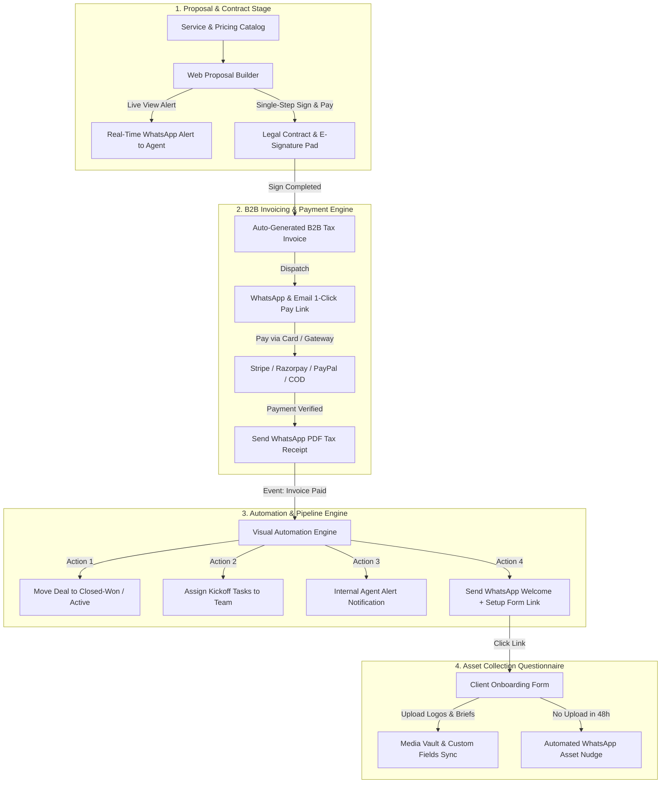

# 🚀 WhatsMine Agency Sales, Invoicing & Onboarding Blueprint

> **Comprehensive Technical Specification & Architectural Blueprint**  
> *Designing a streamlined, interconnected Agency Module within WhatsMine covering Proposals, Contracts (E-Signatures), B2B Invoicing, WhatsApp Payment Links, Smart Automation Engine Hooks, and Post-Payment Asset Onboarding.*

---

## 1. Executive Summary & Core Architecture

This specification outlines the architecture for the **WhatsMine Agency Sales & Onboarding Suite**. 

By focusing on high-converting client acquisition without complex multi-tenant portals or sub-account cloning, this module connects **Proposals**, **Contracts**, **Invoices**, **WhatsApp Payment Links**, and **Asset Collection Forms** into a single WhatsApp-native workflow wired directly into the **WhatsMine Automation Engine**.

---

## 2. Products & Service Offers Catalog

The catalog defines agency service offerings and pricing tiers.

### Pricing Models Supported:
* **Fixed One-Time Fees**: Website builds, technical audits, setup fees (e.g. `$1,500`).
* **Recurring Subscriptions**: Monthly retainers, ad management, software licenses (e.g. `$499/month`).
* **Installment / Multi-Pay**: Split-payment agreements (e.g. `3 monthly payments of $500`).

### Delivery & Sharing Channels:
1. **WhatsApp Chat & Inbox**: Share direct service payment links (`/s/{store_slug}/p/{product_slug}`).
2. **Interactive Web Proposals**: Embed pricing options in interactive client proposals.
3. **Funnel Page Builder**: Embed 1-step and 2-step checkout widgets.

---

## 3. Proposals, Contracts & E-Signatures

Combines proposal presentation and legally binding contract signing into a single smooth flow.

### Key Mechanics:
* **Dynamic Variable Placeholders**: Auto-fills client and agency data (`{{ contact.name }}`, `{{ contact.company_name }}`, `{{ deal.value }}`, `{{ date.today }}`).
* **Interactive Scope Selector**: Allows the lead to select package tiers (*Standard vs. Premium*) and optional add-ons before signing.
* **Single-Step "Sign & Pay" Checkout**:
  * Combines contract signature pad and deposit payment into one seamless responsive page.
* **Proposal Expiration & Countdown Timers**:
  * Visual urgency timer (*"Offer valid for 72 hours"*).
  * Auto-dispatches a WhatsApp discount expiration reminder 24h prior to expiry.
* **Legally Binding E-Signature Engine**:
  * Touch & Mouse **Draw Signature Pad** or typed signature font.
  * **Audit Log Generation**: Captures Client IP Address, Device Fingerprint, Timestamp, and Cryptographic Hash Certificate.
* **Counter-Signatures**: Agency manager receives a WhatsApp/Email notification to counter-sign.

---

## 4. B2B Invoicing & Payment Gateway Integration

Extends WhatsMine's payment engine beyond standard storefront checkouts to handle custom B2B agency invoices.

### Billing Execution Workflow:
1. **Auto-Conversion**: Signed contracts automatically generate an itemized invoice.
2. **Line-Item Customization**: Supports Quantity × Rate + Tax Rate (GST/VAT) + Coupon Discounts.
3. **WhatsApp 1-Click Payment Link**: Dispatches an interactive WhatsApp message containing the payment link.
4. **Instant WhatsApp PDF Receipt**: Generates a branded PDF tax receipt and sends it as a WhatsApp document attachment immediately after payment.
5. **Automated Payment Reminders**: WhatsApp reminders sent before due date (D-2) and after due date (D+3, D+7) if unpaid.

---

## 5. Client Onboarding Questionnaire & Asset Vault

Once payment is verified, the client is guided to an onboarding questionnaire to collect necessary project assets.

### Asset Collection Mechanics:
* **Multi-File Upload Inputs**: Securely upload brand logos, style guides, access credentials, and briefs.
* **Custom Field Mapping**: Automatically maps form responses to contact custom fields (e.g. `{{ contact.target_keywords }}`, `{{ contact.brand_color }}`).
* **Media Vault Storage**: Uploaded files are saved to the workspace's encrypted Media Vault and linked directly to the Client Contact profile.
* **Automated Asset Nudges**: If assets remain unsubmitted after 48 hours, an automated WhatsApp follow-up reminder is dispatched.

---

## 6. Automation Engine Enhancements & GHL Comparison

To support this module, WhatsMine's `AutomationEngine.php` receives 5 new event triggers, 4 new action nodes, and 3 engine enhancements matching GoHighLevel's best capabilities.

### 6.1 New Automation Triggers:
* `proposal_viewed`: Fires when prospect opens the proposal link.
* `contract_signed`: Fires when client signs contract.
* `invoice_created`: Fires when new invoice is issued.
* `invoice_paid`: Fires when card/gateway payment succeeds.
* `onboarding_form_submitted`: Fires when onboarding form assets are uploaded.

### 6.2 New Automation Action Nodes:
* `move_deal_stage`: Moves pipeline deal to `Closed-Won` or `Active`.
* `generate_invoice_payment_link`: Creates dynamic 1-click payment URL.
* `send_whatsapp_invoice_pdf`: Attaches and dispatches PDF receipt on WhatsApp.
* `create_team_task`: Assigns kickoff tasks to team members.
* `internal_agent_alert`: Sends a WhatsApp/Push notification to internal team reps (*"John Doe just viewed proposal!"*).

### 6.3 Engine Enhancements (GHL Parity):
1. **Smart Goal / Event Wait Node**: Ability to pause a workflow with `Wait until [Event] occurs OR [X] Hours Pass` (e.g. Wait for Contract Sign or 48h expiry).
2. **Execution Time Windows (Quiet Hours)**: Restrict automated message dispatch to client local business hours (e.g. Mon-Fri 9 AM – 6 PM).
3. **Internal Agent WhatsApp Alerts**: Instantly alert sales reps via WhatsApp when leads view proposals or complete payments.

---

## 7. Competitor Comparison Matrix

| Feature / Capability | GoHighLevel (GHL) | HoneyBook / Bonsai | **WhatsMine (Proposed)** |
|---|---|---|---|
| **Primary Channel** | Email / SMS | Email | 🚀 **WhatsApp Native (Unique Superpower)** |
| **Real-Time View Alerts** | Email | Email | 🚀 **WhatsApp Instant Sales Alert** |
| **Proposals & Contracts** | Web document | Web document | ✅ Web document + E-Signature |
| **Sign & Pay Flow** | 2-Step | 1-Step | 🚀 **Single-Step Sign & Pay** |
| **PDF Receipt Delivery** | Email | Email | 🚀 **WhatsApp PDF Document Attachment** |
| **Smart Event Wait Nodes** | ✅ Yes | ❌ No | 🚀 **Smart Goal Wait Node** |
| **Quiet Hours Window** | ✅ Yes | ❌ No | 🚀 **Local Business Hours Window** |

---

## 8. Core Feature Summary Matrix

| Module | Core Function | Primary Trigger / Outcome |
|---|---|---|
| **Service Catalog** | One-Time, Subscription, & Installment Services | Powers Funnels, Proposals, & Invoices |
| **Proposals & Contracts** | Web document + interactive pricing + E-Signature pad | `On Signed` ➔ Auto-generates Tax Invoice & PDF |
| **B2B Invoicing** | Line-item invoice builder + WhatsApp Pay link | `On Paid` ➔ Fires PDF receipt & Automations |
| **Onboarding Form** | Asset collection (Logos, Briefs, Credentials) | `On Submit` ➔ Syncs Media Vault & Custom Fields |
| **Automation Engine** | Event triggers, Smart Goal Waits, Agent Alerts | Moves deal, assigns tasks, dispatches WhatsApp |
