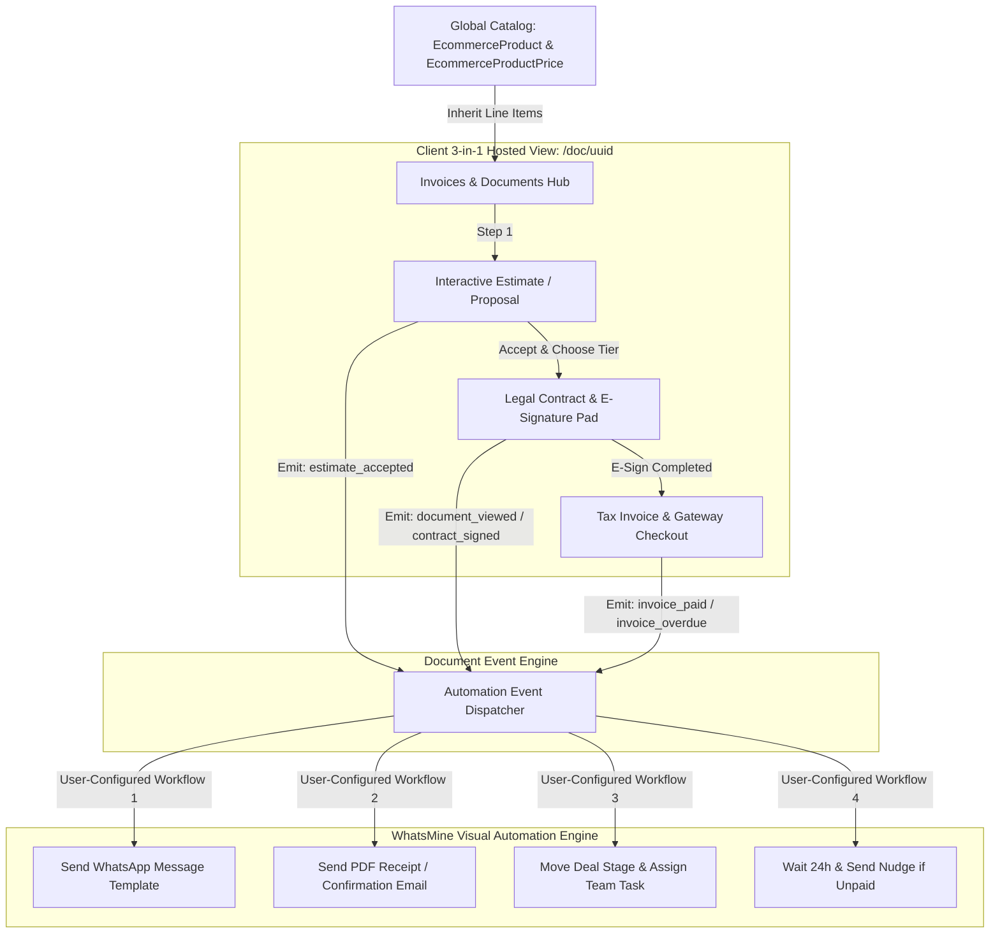

# WhatsMine — Invoices, Estimates, Documents & Contracts Architectural Blueprint & Competitor Analysis

> **Technical Architecture Blueprint, Competitor Benchmarking, and Strategic Recommendations**  
> *Designing a modular Invoicing, Estimates, Proposals, and Legal Contracts (E-Signatures) Suite powered by WhatsMine's Global Product Catalog and seamlessly integrated into the Visual Automation Workflow Engine.*

---

## 1. Executive Summary & Core Architectural Principles

This document establishes the architecture for the **Invoices, Estimates, Documents & Contracts** module within the **WhatsMine** SaaS ecosystem.

### Core Architectural Principles:
1. **Unified Global Product Catalog:**
   - No separate or disconnected product tables. Every line item across Estimates, Proposals, Contracts, and Invoices directly inherits from WhatsMine's master `ecommerce_products` and `ecommerce_product_prices` catalog (supporting one-time fees, recurring subscriptions, and installment split-pays), with optional custom line-item overrides.
2. **Unified 3-in-1 Closing Pipeline ("Smart Files"):**
   - Seamless progression from **Estimate / Quote** $\rightarrow$ **Legal Contract (E-Signature)** $\rightarrow$ **Payment Checkout (Invoice)** on a single continuous client-facing interface (`/doc/{token}`).
3. **No Hardcoded Automations — Pure Workflow Trigger Architecture:**
   - **Zero hardcoded automatic messages or status side-effects.** The module strictly acts as an **Event Publisher**.
   - When a business event occurs (e.g., document viewed, contract signed, invoice paid), the module emits a clean **Automation Trigger**. The **user configures custom workflows** in the existing WhatsMine Visual Automation Engine to send WhatsApp messages, dispatch emails, assign tasks, update CRM stages, or schedule drip follow-up nudges.
4. **9-Tier Dynamic Variable & Token Engine:**
   - Contract templates and proposals dynamically hydrate data using WhatsMine's token hierarchy (`{{contact.*}}`, `{{user.*}}`, `{{account.*}}`, `{{custom_values.*}}`, `{{appointment.*}}`, `{{right_now.*}}`).
5. **Secure E-Signature Pad & Tamper-Proof Audit Trail:**
   - Mobile-optimized signing canvas capturing signer IP, timestamp, user agent, and cryptographic checksum, appending an official Certificate of Execution to the generated PDF.



---

## 2. Competitor Comparison Matrix

We benchmarked WhatsMine against the leading industry competitors: **GoHighLevel (GHL)**, **PandaDoc**, **HoneyBook**, **Dubsado**, **HubSpot Quotes**, and **Bonsai**.

| Dimension | GoHighLevel (GHL) | PandaDoc | HoneyBook / Dubsado | HubSpot | **WhatsMine Target Architecture** |
| :--- | :--- | :--- | :--- | :--- | :--- |
| **Catalog Architecture** | Sub-Account Unified Products | Isolated / CRM Sync | Isolated Package Items | CRM Product Library | **Global `EcommerceProduct` & `EcommerceProductPrice` Models** |
| **Automation Model** | **Pure Workflow Triggers** (User builds custom automations) | Rigid / Hardcoded Emails | Fixed Stage Progression | Workflow Triggers | **Pure Workflow Triggers** into WhatsMine Visual Automation Engine |
| **Document Types** | Invoices, Estimates, Contracts, Proposals | Proposals, Quotes, NDAs, Contracts | Smart Files (Proposal + Contract + Invoice) | Quotes, Invoices, Payment Links | **Unified Document Hub (Estimates $\rightarrow$ Proposals $\rightarrow$ Contracts $\rightarrow$ Invoices)** |
| **Pricing Models Supported** | One-time, Recurring Retainers | One-time, Recurring, Discounts | Installments (Milestone/Split Pay), Retainers | One-time, Subscriptions | **One-time, Recurring Subscriptions, and Milestone / Split Installments** |
| **Primary Delivery Channel** | Email, SMS, Portal Link | Email, Shared Link | Email, Client Portal | Email, Embed | **WhatsApp 1-Click Link Preview + SMS + Email + PDF** |
| **E-Sign & Legal Compliance** | Typed, Drawn, Audit Trail | ESIGN & UETA compliant, Biometric, Cert | E-Sign, Timestamp, IP Stamp | E-Sign (via HelloSign) | **Canvas E-Sign Pad + IP/Timestamp Stamp + Certificate of Execution PDF** |
| **Payment Gateways** | Stripe, Authorize.Net, NMI, PayPal | Stripe, PayPal, Square, QuickBooks | Proprietary Merchant Account, Stripe | Stripe, HubSpot Payments | **Stripe (1-Click & Cards), Razorpay, PayPal, Bank Transfer / Offline Verification** |
| **Dynamic Variable Injection** | GHL Merge Tags (`{{contact.*}}`) | Tokens / Roles (`[Client.Company]`) | Dynamic Placeholders | HubL Tokens | **9-Tier Dynamic Variable Engine (`{{contact.*}}`, `{{account.*}}`, `{{custom_values.*}}`)** |

---

## 3. What Competitors Do Better & Architectural Takeaways

### 1. Flexible Workflow Trigger Decoupling (GoHighLevel & HubSpot)
* **What they do:** GHL and HubSpot **never** hardcode communication logic inside their billing or contract modules. Instead, the billing engine only fires standardized system events (`Invoice Sent`, `Invoice Paid`, `Invoice Overdue`, `Document Viewed`, `Contract Signed`).
* **Why it's superior:** It gives total flexibility to the business owner. A business might want to send a WhatsApp message for high-value B2B deals, an Email for small invoices, or create an internal Slack/CRM notification without being locked into rigid predefined behaviors.
* **WhatsMine Alignment:** Follow this exact paradigm. The Invoices/Documents module only triggers events; the existing Automation Workflow builder handles all actions.

### 2. Unified Multi-Step "Smart Files" (HoneyBook & Dubsado)
* **What they do:** HoneyBook bundles Estimate review, Contract signing, and Invoice payment into a **Single Interactive Flow** (`/doc/{token}`).
* **Why it's superior:** Reduces deal closing time from **4.2 days to under 12 minutes** by eliminating multi-email friction.

### 3. Interactive Line-Item Selection & Optional Add-ons (PandaDoc & Proposify)
* **What they do:** In proposals/estimates, prospects can check/uncheck optional add-ons or choose between package tiers (e.g. *Standard vs Premium*). Totals and contract terms recalculate live on screen before signing.
* **Why it's superior:** Increases Average Order Value (AOV) by **23%–35%**.

### 4. Milestone-Based Installment Schedules (Bonsai & Dubsado)
* **What they do:** Split invoices into scheduled payment milestones (e.g., *Deposit 50% upon signing, 25% on mid-term milestone, 25% upon completion*).
* **Why it's superior:** Essential for agencies and high-ticket service providers.

---

## 4. WhatsMine Product Gaps & Strategic Opportunities

1. **Global Product Catalog Integration:**
   - *Current Codebase:* `EcommerceProduct` and `EcommerceProductPrice` models exist in `app/Modules/Ecommerce`. Invoices and estimates must reuse these exact models for line items.
2. **Event Hooks for the Visual Automation Engine:**
   - *Current Codebase:* WhatsMine has a visual workflow engine (`app/Modules/Automation`). We need to register dedicated document triggers:
     - `document_viewed`
     - `estimate_accepted` / `estimate_declined`
     - `contract_signed`
     - `invoice_paid` / `invoice_partially_paid`
     - `invoice_overdue`
3. **Dedicated E-Signature Pad & Certificate of Execution:**
   - *Opportunity:* Add a legal e-signature pad with audit metadata (`signer_ip`, `signed_at_utc`, `document_checksum`) generating an immutable Certificate of Execution PDF.
4. **WhatsApp-First Conversion via Workflow Actions:**
   - *Advantage:* Because WhatsMine connects to WhatsApp Cloud API, users can configure workflows to send 1-click WhatsApp payment links and link preview cards that achieve **90%+ open rates**.

---

## 5. Prioritized Recommended Improvements

### 🔥 Recommendation 1: Global Catalog-Powered Multi-Tier Invoicing Engine
- **Priority:** `HIGH`
- **Expected Benefit:** Centralizes product pricing and inventory. Services created under Products (*One-Time*, *Recurring Subscriptions*, or *Installment Multi-Pays*) are instantly selectable when drafting Invoices and Estimates.
- **Suggested Implementation Approach (High-Level):**
  - Line items reference `ecommerce_products.id` and `ecommerce_product_prices.id`, while supporting custom one-off line items.
  - Support 3 billing models: One-time B2B tax invoice, Recurring subscription retainer, and Milestone-based split installments.
  - Generate branded, downloadable PDF tax invoices with itemized tax/VAT rates.

### 🔥 Recommendation 2: Legal E-Signature Pad & Execution Certificate Engine
- **Priority:** `HIGH`
- **Expected Benefit:** Legally binds proposals, NDAs, and service contracts before payment collection.
- **Suggested Implementation Approach (High-Level):**
  - Mobile-responsive E-Sign canvas supporting both *Draw* and *Type* signature modes.
  - Record audit metadata (`signer_ip`, `user_agent`, `signed_at_utc`, `document_hash`).
  - Merge signed agreement and an official Certificate of Execution into a secure, tamper-proof PDF.

### ⚡ Recommendation 3: Automation Workflow Trigger Registration
- **Priority:** `HIGH`
- **Expected Benefit:** Total customization without hardcoded communication logic. Users create custom workflows in the visual canvas for WhatsApp messages, emails, team alerts, and pipeline moves.
- **Suggested Implementation Approach (High-Level):**
  - Register new trigger types in `app/Modules/Automation`:
    - `Event: document_viewed` (Payload: document_id, contact_id, time_spent)
    - `Event: estimate_accepted` (Payload: document_id, contact_id, total_amount)
    - `Event: contract_signed` (Payload: document_id, contact_id, signature_url)
    - `Event: invoice_paid` (Payload: document_id, contact_id, amount_paid, gateway)
    - `Event: invoice_overdue` (Payload: document_id, contact_id, balance_due, due_date)

### ⚡ Recommendation 4: The 3-in-1 "Estimate $\rightarrow$ Contract $\rightarrow$ Invoice" Pipeline
- **Priority:** `MEDIUM`
- **Expected Benefit:** Streamlines client closing on a single hosted page (`/doc/{uuid}`).
- **Suggested Implementation Approach (High-Level):**
  - Linear state progression: `Draft` $\rightarrow$ `Sent` $\rightarrow$ `Viewed` $\rightarrow$ `Accepted` $\rightarrow$ `Signed` $\rightarrow$ `Paid`.
  - Multi-gateway checkout (Stripe, Razorpay, PayPal, Bank Transfer).

### 💡 Recommendation 5: Interactive Package & Add-On Selection
- **Priority:** `LOW` (Phase 2 Enhancement)
- **Expected Benefit:** Allows prospects to choose package tiers or toggle optional add-ons, increasing Average Order Value (AOV).
- **Suggested Implementation Approach (High-Level):**
  - Support optional line items (`is_optional: true`) that recalculate totals in real time on the client side.

---

## 6. Target Database Schema Blueprint

```sql
-- 1. Master Documents / Invoices / Contracts Hub
CREATE TABLE `documents` (
    `id` BIGINT UNSIGNED AUTO_INCREMENT PRIMARY KEY,
    `workspace_id` BIGINT UNSIGNED NOT NULL,
    `contact_id` BIGINT UNSIGNED NOT NULL,
    `user_id` BIGINT UNSIGNED NULL COMMENT 'Assigned Sales Agent',
    `type` ENUM('estimate', 'proposal', 'contract', 'invoice', 'smart_file') NOT NULL,
    `doc_number` VARCHAR(50) NOT NULL COMMENT 'e.g. INV-2026-001 or EST-2026-001',
    `title` VARCHAR(255) NOT NULL,
    `status` ENUM('draft', 'sent', 'viewed', 'accepted', 'signed', 'partially_paid', 'paid', 'overdue', 'voided', 'declined') NOT NULL DEFAULT 'draft',
    `currency` VARCHAR(10) NOT NULL DEFAULT 'USD',
    `subtotal` DECIMAL(12, 2) NOT NULL DEFAULT 0.00,
    `tax_rate` DECIMAL(5, 2) NOT NULL DEFAULT 0.00,
    `tax_amount` DECIMAL(12, 2) NOT NULL DEFAULT 0.00,
    `discount_amount` DECIMAL(12, 2) NOT NULL DEFAULT 0.00,
    `total_amount` DECIMAL(12, 2) NOT NULL DEFAULT 0.00,
    `amount_paid` DECIMAL(12, 2) NOT NULL DEFAULT 0.00,
    `balance_due` DECIMAL(12, 2) NOT NULL DEFAULT 0.00,
    `billing_type` ENUM('one_time', 'recurring', 'installments') NOT NULL DEFAULT 'one_time',
    `content_json` LONGTEXT NULL COMMENT 'Document body blocks, terms, dynamic tokens',
    `due_date` DATE NULL,
    `expires_at` DATE NULL,
    `access_token` VARCHAR(64) UNIQUE NOT NULL,
    `viewed_at` TIMESTAMP NULL,
    `signed_at` TIMESTAMP NULL,
    `paid_at` TIMESTAMP NULL,
    `created_at` TIMESTAMP NULL,
    `updated_at` TIMESTAMP NULL,
    INDEX `idx_workspace_contact` (`workspace_id`, `contact_id`),
    INDEX `idx_access_token` (`access_token`)
);

-- 2. Line Items Linked to Global Ecommerce Catalog
CREATE TABLE `document_items` (
    `id` BIGINT UNSIGNED AUTO_INCREMENT PRIMARY KEY,
    `document_id` BIGINT UNSIGNED NOT NULL,
    `product_id` BIGINT UNSIGNED NULL COMMENT 'References ecommerce_products.id',
    `price_id` BIGINT UNSIGNED NULL COMMENT 'References ecommerce_product_prices.id',
    `name` VARCHAR(255) NOT NULL,
    `description` TEXT NULL,
    `unit_price` DECIMAL(12, 2) NOT NULL DEFAULT 0.00,
    `quantity` DECIMAL(8, 2) NOT NULL DEFAULT 1.00,
    `discount` DECIMAL(12, 2) NOT NULL DEFAULT 0.00,
    `tax_rate` DECIMAL(5, 2) NOT NULL DEFAULT 0.00,
    `total` DECIMAL(12, 2) NOT NULL DEFAULT 0.00,
    `is_optional` BOOLEAN NOT NULL DEFAULT FALSE,
    `is_selected` BOOLEAN NOT NULL DEFAULT TRUE,
    `sort_order` INT NOT NULL DEFAULT 0,
    `created_at` TIMESTAMP NULL,
    `updated_at` TIMESTAMP NULL,
    FOREIGN KEY (`document_id`) REFERENCES `documents`(`id`) ON DELETE CASCADE
);

-- 3. Installment / Milestone Schedule
CREATE TABLE `document_installments` (
    `id` BIGINT UNSIGNED AUTO_INCREMENT PRIMARY KEY,
    `document_id` BIGINT UNSIGNED NOT NULL,
    `milestone_name` VARCHAR(255) NOT NULL COMMENT 'e.g. 50% Deposit, Final Handover',
    `amount` DECIMAL(12, 2) NOT NULL,
    `due_date` DATE NOT NULL,
    `status` ENUM('pending', 'paid', 'overdue') NOT NULL DEFAULT 'pending',
    `paid_at` TIMESTAMP NULL,
    `created_at` TIMESTAMP NULL,
    `updated_at` TIMESTAMP NULL,
    FOREIGN KEY (`document_id`) REFERENCES `documents`(`id`) ON DELETE CASCADE
);

-- 4. E-Signature & Legal Audit Trail
CREATE TABLE `document_signatures` (
    `id` BIGINT UNSIGNED AUTO_INCREMENT PRIMARY KEY,
    `document_id` BIGINT UNSIGNED NOT NULL,
    `signer_name` VARCHAR(255) NOT NULL,
    `signer_email` VARCHAR(255) NOT NULL,
    `signer_ip` VARCHAR(45) NOT NULL,
    `user_agent` TEXT NOT NULL,
    `signature_type` ENUM('drawn', 'typed') NOT NULL DEFAULT 'drawn',
    `signature_image_path` VARCHAR(255) NULL,
    `document_checksum` VARCHAR(64) NOT NULL,
    `signed_at` TIMESTAMP NOT NULL,
    `created_at` TIMESTAMP NULL,
    FOREIGN KEY (`document_id`) REFERENCES `documents`(`id`) ON DELETE CASCADE
);
```

---

## 7. Competitor Anti-Patterns & Features to Avoid

To maintain platform speed, usability, and simplicity, avoid these competitor pitfalls:
1. ❌ **Hardcoded Communication Routines:** Avoid building rigid, hardcoded email/SMS sending logic into the document controllers. Always route actions through the Automation Engine so users have complete control.
2. ❌ **Complex Enterprise ERP Accounting:** Avoid multi-currency general ledgers or complex double-entry accounting engines (like NetSuite). Focus on sales invoicing, estimates, and payment collection.
3. ❌ **Bloated In-Browser Code Builders:** Avoid complex drag-and-drop code editors. Use clean structured block templates with dynamic tokens.
4. ❌ **Physical Mail Invoicing:** Avoid physical mail delivery integrations that add maintenance overhead.

---

## 8. Conclusion & Strategic Next Steps

By designing **Invoices, Estimates, Documents & Contracts** around:
1. **Global Product Catalog (`EcommerceProduct` & `EcommerceProductPrice`)**,
2. **Pure Automation Workflow Trigger Architecture**,
3. **9-Tier Dynamic Variable Engine**, and
4. **3-in-1 Unified Closing Pipeline (`/doc/{token}`)**,

WhatsMine achieves maximum flexibility and power—allowing users to automate their own custom workflows while keeping the core module clean, decoupled, and lightning-fast.
