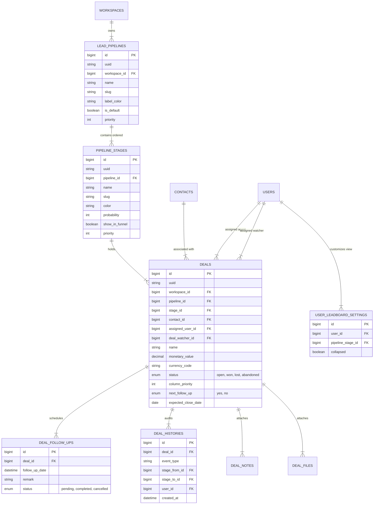
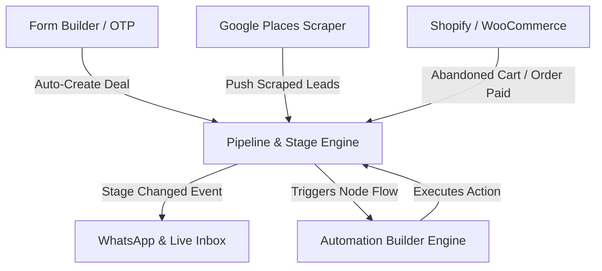

# 📊 Lead Pipeline & CRM Deal Stages: Complete Technical Specification & Implementation Guide

This document provides a comprehensive, production-grade technical specification, competitor comparison (**GoHighLevel & Worksuite**), and architectural blueprint for implementing a full **Lead Pipeline / CRM Deal Stages & Opportunities** engine in the **WhatsMine** platform.

---

## 📑 Table of Contents
1. [Overview & Executive Summary](#1-overview--executive-summary)
2. [Comparative Analysis: GoHighLevel vs. Worksuite vs. WhatsMine](#2-comparative-analysis-gohighlevel-vs-worksuite-vs-whatsmine)
3. [Core Architectural Concepts & ERD](#3-core-architectural-concepts--erd)
   - [3.1 Conceptual Entity Definitions](#31-conceptual-entity-definitions)
   - [3.2 Entity-Relationship Diagram (ERD)](#32-entity-relationship-diagram-erd)
4. [Pipelines & Stages Management](#4-pipelines--stages-management)
   - [Pipeline Creation & Configuration](#pipeline-creation--configuration)
   - [Stage Reordering & Priority Algorithm](#stage-reordering--priority-algorithm)
   - [Custom Stage Colors & Visibility Toggles](#custom-stage-colors--visibility-toggles)
   - [Safe Stage Deletion (Opportunity Migration)](#safe-stage-deletion-opportunity-migration)
5. [Opportunity & Deal Lifecycle Management](#5-opportunity--deal-lifecycle-management)
   - [Deal Fields & Metadata](#deal-fields--metadata)
   - [Status Tracking (Open, Won, Lost, Abandoned)](#status-tracking-open-won-lost-abandoned)
   - [Deal Watchers, Agents & Follow-Ups](#deal-watchers-agents--follow-ups)
   - [Kanban Drag-and-Drop vs. High-Density Table View](#kanban-drag-and-drop-vs-high-density-table-view)
6. [Permissions, Access Control & User Preferences](#6-permissions-access-control--user-preferences)
7. [Opportunity Forecasting & Revenue Analytics](#7-opportunity-forecasting--revenue-analytics)
8. [Automation Engine Integration (Triggers & Actions)](#8-automation-engine-integration-triggers--actions)
9. [Complete Database Schema Specification](#9-complete-database-schema-specification)
10. [API Endpoint Specification](#10-api-endpoint-specification)
11. [Frontend React Component Blueprint & Drag-and-Drop Handler](#11-frontend-react-component-blueprint--drag-and-drop-handler)
12. [Risk Assessment, Edge Cases & Proactive Prevention Blueprint](#12-risk-assessment-edge-cases--proactive-prevention-blueprint)

---

## 1. Overview & Executive Summary

A **Lead Pipeline** is a visual, multi-stage sales operations system. It tracks potential revenue (**Opportunities / Deals**) as they move through sequential business steps (**Stages**)—from initial lead capture to closing a deal, collecting payment, or onboarding a client.

```
┌──────────────────────────────────────────────────────────────────────────────────────────────────────────────────┐
│                                       SALES & OPPORTUNITIES PIPELINE                                             │
├──────────────────────┬──────────────────────┬──────────────────────┬──────────────────────┬──────────────────────┤
│  1. NEW INQUIRY      │  2. QUALIFIED        │  3. DEMO SCHEDULED   │ 4. PROPOSAL SENT     │  5. CLOSED WON 🏆    │
├──────────────────────┼──────────────────────┼──────────────────────┼──────────────────────┼──────────────────────┤
│ 👤 Acme Corp         │ 👤 TechStart Ltd     │ 👤 Jane Doe          │ 👤 BigCo Inc         │ 👤 Mega Enterprise   │
│ 💰 $2,500            │ 💰 $7,500            │ 💰 $4,000            │ 💰 $15,000           │ 💰 $45,000           │
│ 🟢 Open              │ 🟢 Open              │ 🟢 Open              │ 🟢 Open              │ 🏆 Won               │
│ 👤 Agent: Sarah      │ 👤 Agent: Mike       │ 👤 Agent: Alex       │ 👤 Agent: Sarah      │ 👤 Agent: Alex       │
│ 👁️ Watcher: Manager │ 👁️ Watcher: Manager │ 👁️ Watcher: Admin   │ 👁️ Watcher: Manager │ 👁️ Watcher: Admin    │
│ ⏰ Follow-up: Aug 20 │ ⏰ Follow-up: Aug 22 │ ⏰ Follow-up: Aug 24 │ ⏰ Follow-up: Aug 25 │ ──────               │
└──────────────────────┴──────────────────────┴──────────────────────┴──────────────────────┴──────────────────────┘
```

---

## 2. Comparative Analysis: GoHighLevel vs. Worksuite vs. WhatsMine

By combining the strengths of **GoHighLevel (GHL)** (marketing & workflow-centric) and **Worksuite** (project & task-centric CRM), WhatsMine achieves an industry-leading pipeline solution:

| Feature / Capability | GoHighLevel (GHL) | Worksuite CRM | WhatsMine Unified Design |
| :--- | :--- | :--- | :--- |
| **Pipeline & Stage Customization** | ✅ Unlimited multi-pipelines & stage creation | ✅ Pipelines (`lead_pipelines`) & Stages (`pipeline_stages`) | ✅ Multi-pipeline, custom stage ordering & colors |
| **Custom Stage Colors** | ✅ Per-stage color header picker | ❌ Plain styling | ✅ Color-coded Kanban headers & stage badges |
| **Safe Stage Deletion** | ✅ Move existing deals to another stage | ⚠️ Standard deletion | ✅ Mandatory migration dialog (Zero Data Loss) |
| **Deal Owner & Secondary Watcher** | 🟡 Single assigned owner | ✅ Primary Agent (`agent_id`) & Watcher (`deal_watcher`) | ✅ Dual ownership (`agent_id` + `deal_watcher_id`) |
| **Scheduled Follow-Ups & Tasks** | 🟡 Workflow task actions | ✅ Direct deal follow-up scheduling (`deal_follow_ups`) | ✅ Integrated follow-up calendar & alert engine |
| **Card Positioning & Priority** | 🟡 Automatic sorting | ✅ Explicit column priority (`column_priority`) | ✅ Column priority indexing (`column_priority`) |
| **Outcome Status Tracking** | ✅ Open, Won, Lost, Abandoned | 🟡 Win / Lost stage slugs | ✅ Status flags (`open`, `won`, `lost`, `abandoned`) |
| **Pipeline Forecasting Calculation** | ✅ Weighted Revenue ($\text{Val} \times \text{Prob} \% $) | ❌ Simple totals | ✅ Weighted pipeline forecasting dashboard |
| **Automation Engine Integration** | ✅ Full workflow triggers & actions | ❌ Manual updates | ✅ Integrated with WhatsMine `AutomationEngine.php` |

---

## 3. Core Architectural Concepts & ERD

### 3.1 Conceptual Entity Definitions
* **Pipeline (`lead_pipelines`)**: Top-level workflow container (e.g. *B2B Sales*, *Agency Services*, *Re-activation*).
* **Stage (`pipeline_stages`)**: A column step within a pipeline containing a priority order index, win probability percentage, and label color.
* **Opportunity / Deal (`deals`)**: A prospective commercial transaction linked to a Contact, holding financial valuation, status, assigned agent, watcher, and card priority.
* **Deal Follow-Up (`deal_follow_ups`)**: Scheduled reminders or call tasks linked directly to a deal.
* **Deal Audit Trail (`deal_histories`)**: Immutable log recording stage transitions, notes, file attachments, and assignment changes.

### 3.2 Entity-Relationship Diagram (ERD)



---

## 4. Pipelines & Stages Management

> [!NOTE]
> ⚡ **Fully Dynamic & Custom Stages**: Pipeline stages are **never fixed or hardcoded**. Users have 100% control to create, rename, reorder, color-code, and configure as many stages as required for their specific industry and workflow (e.g., Real Estate, SaaS B2B, Coaching, Agency, Local Services).

### Pipeline Creation & Configuration
Users access **App → Opportunities → Pipelines** to manage pipelines and dynamic stages:
1. **Pipeline Title**: Name (e.g. *Inbound B2B Pipeline*, *High-Ticket Coaching*, *Service Onboarding*).
2. **Dynamic Stage Customization**: Add as many custom stage columns as needed.
3. **Default Pipeline**: Set primary default pipeline for newly captured leads.
4. **Stage Ordering**: Drag-and-drop horizontal column reordering.

---

### Stage Reordering & Priority Algorithm
When pipeline stages are created, edited, or reordered dynamically by users, priority indices are recalculated to prevent gap values:

```php
// Re-indexing priority sequence on new stage insertion/reorder
PipelineStage::where('pipeline_id', $pipelineId)
    ->where('priority', '>=', $newPosition)
    ->increment('priority');
```

---

### Custom Stage Colors & Visibility Toggles
* **Header Accent Colors**: Custom HEX codes (e.g., `#3b82f6` Blue, `#8b5cf6` Purple, `#10b981` Green).
* **Funnel Reporting Toggle (`show_in_funnel`)**: Toggles whether opportunities in a stage count toward conversion funnel reports.

---

### Safe Stage Deletion (Opportunity Migration)
Deleting a stage containing active deals requires migrating deals to another stage:

```
┌────────────────────────────────────────────────────────────────────────┐
│ 🗑️ Delete Stage: "Discovery Call"                                     │
├────────────────────────────────────────────────────────────────────────┤
│ Warning: This stage currently contains 14 active deals.                │
│ Select a destination stage to migrate these deals before deleting:      │
│                                                                        │
│ Destination Stage: [ 2. Qualified Lead  ▼ ]                            │
│                                                                        │
│ [ Cancel ]                                     [ Migrate & Delete Stage ]│
└────────────────────────────────────────────────────────────────────────┘
```

---

## 5. Opportunity & Deal Lifecycle Management

### Deal Fields & Metadata
Each Deal record stores exhaustive commercial metadata:

| Field | Type | Description |
| :--- | :--- | :--- |
| `name` | String | Deal title (e.g., *Acme Corp - 100 Licenses*). |
| `contact_id` | Foreign Key | Linked primary contact. |
| `pipeline_id` | Foreign Key | Parent pipeline. |
| `stage_id` | Foreign Key | Active pipeline stage column. |
| `assigned_user_id` | Foreign Key | Primary assigned sales agent. |
| `deal_watcher_id` | Foreign Key | Secondary owner / supervisor. |
| `monetary_value` | Decimal(12,2) | Total financial value of deal (e.g., `$15,000.00`). |
| `currency_code` | String | Currency symbol/code (`USD`, `EUR`, `INR`). |
| `status` | Enum | Commercial outcome (`open`, `won`, `lost`, `abandoned`). |
| `column_priority` | Integer | Vertical position index of card inside stage column. |
| `next_follow_up` | Enum | `yes` / `no` flag indicating active scheduled follow-up. |
| `expected_close_date` | Date | Target closing date. |

---

### Status Tracking (Open, Won, Lost, Abandoned)
* **Open (🟢)**: Active deal being worked through pipeline stages.
* **Won (🏆)**: Successfully closed deal (counted in Revenue & Win Rate metrics).
* **Lost (🔴)**: Deal lost to a competitor or rejected.
* **Abandoned (⚪)**: Lead that went unresponsive without explicit rejection.

---

### Deal Watchers, Agents & Follow-Ups
* **Dual Ownership**: Supports both an **Assigned Agent** (primary closer) and a **Deal Watcher** (sales manager or account manager receiving notifications).
* **Scheduled Follow-Ups (`deal_follow_ups`)**: Direct integration with calendar reminders and WhatsApp/Email follow-up notifications.

---

### Kanban Drag-and-Drop vs. High-Density Table View

#### 1. Visual Kanban Board View
* **Horizontal Scroll Canvas**: Column headers display stage total deal counts and sum value (e.g. *Proposal: 5 Deals · $62,500*).
* **Drag-and-Drop Action**: Drag cards vertically to reorder within a column or horizontally to advance stages.
* **Collapsed Columns (`user_leadboard_settings`)**: Users can collapse unused columns to save screen space.

#### 2. Tabular List View
* High-density grid view with batch selection, bulk stage reassignment, CSV export, and filtering.

---

## 6. Permissions, Access Control & User Preferences

* **View All Deals**: Admins and Sales Managers can view deals across all agents.
* **View Assigned Deals Only**: Agents can only view/drag deals where `assigned_user_id === current_user_id` or `deal_watcher_id === current_user_id`.
* **Manage Pipelines Permission**: Restricted to Admins to alter pipeline structures.
* **User Board Settings (`user_leadboard_settings`)**: Remembers user preferences for collapsed columns and default active pipeline.

---

## 7. Opportunity Forecasting & Revenue Analytics

Pipeline Forecasting provides financial predictability by calculating **Weighted Pipeline Value**:

$$\text{Weighted Value} = \text{Monetary Value} \times \left( \frac{\text{Stage Probability \%}}{100} \right)$$

### Analytics Dashboard Metrics
1. **Total Pipeline Value**: Sum of all open deal values.
2. **Weighted Revenue Forecast**: Sum of weighted values across all stages.
3. **Win Rate (%)**: $$\left(\frac{\text{Won Deals}}{\text{Total Closed Deals (Won + Lost)}}\right) \times 100$$
4. **Stage Conversion & Bottleneck Drop-Off Rate**.
5. **Sales Velocity**: Average days taken for a lead to move from Stage 1 to Closed Won.

---

## 8. Automation Engine Integration & Ecosystem Sync (GoHighLevel Parity)

The Lead Pipeline feature is deeply integrated into WhatsMine's **Automation Engine** (`AutomationEngine.php`), enabling multi-channel automated workflows matching **GoHighLevel**.

---

### ⚡ 8.1 Workflow Automation Triggers

| Trigger Name | Code Symbol | Description & Parameters |
| :--- | :--- | :--- |
| **Opportunity Created** | `opportunity.created` | Fires when a new opportunity is created (manual, form, scraper, or API). |
| **Pipeline Stage Changed** | `opportunity.stage_changed` | Fires when an opportunity moves stage. Filters: `pipeline_id`, `from_stage_id`, `to_stage_id`. |
| **Opportunity Status Changed**| `opportunity.status_changed` | Fires when status switches to `won`, `lost`, or `abandoned`. |
| **Stale Opportunity Alert** | `opportunity.stale` | Fires when an opportunity stays unmoved in a stage for > $X$ days. |
| **WhatsApp Inbound / CTA** | `whatsapp.cta_clicked` | Inbound WhatsApp reply or button click triggers stage advancement. |
| **Form Submitted** | `form.submitted` | Web form submission triggers opportunity creation in a target pipeline. |
| **Cart Abandoned / Paid** | `ecommerce.cart_abandoned` | E-commerce trigger creates or advances opportunity. |

---

### 🛠️ 8.2 Workflow Automation Actions (GoHighLevel Parity)

Just like in **GoHighLevel**, users can invoke rich pipeline actions directly inside the Automation Builder node graph:

```
┌────────────────────────────────────────────────────────────────────────────────────────┐
│                               AUTOMATION WORKFLOW NODE GRAPH                           │
├──────────────────┐    ┌─────────────────────────┐    ┌─────────────────────────────────┤
│ ⚡ TRIGGER       │ ──>│ 🛠️ ACTION               │ ──>│ 💬 ACTION                       │
│ Form Submitted   │    │ Create/Update           │    │ Send WhatsApp Template          │
│ (Contact Inquiry)│    │ Opportunity Stage       │    │ "Hi {{contact.name}}, thanks!"   │
│                  │    │ [Pipeline: B2B Sales]   │    │                                 │
│                  │    │ [Stage: 1. New Inquiry] │    │                                 │
└──────────────────┘    └─────────────────────────┘    └─────────────────────────────────┘
```

1. **`create_update_opportunity`**: Creates or updates an opportunity card for the contact in a designated pipeline and stage.
2. **`create_pipeline_stage`**: **Dynamically creates a new pipeline stage via automation** if the stage does not exist (or ensures stage creation).
3. **`change_opportunity_stage`**: Advances or moves the contact's opportunity to a specified target stage (e.g. move to *Proposal Sent*).
4. **`assign_opportunity_owner`**: Assigns the primary sales agent (`assigned_user_id`) and secondary watcher (`deal_watcher_id`).
5. **`mark_opportunity_status`**: Sets deal outcome status (`won`, `lost`, `abandoned`).
6. **`schedule_deal_followup`**: Automatically schedules a follow-up task/reminder in `deal_follow_ups`.
7. **`add_opportunity_note`**: Attaches an audit note or tag to the opportunity card.
8. **`remove_opportunity`**: Deletes or archives the deal.

---

### 🌐 8.3 Cross-Feature Ecosystem Sync (WhatsMine Superpower)



1. **WhatsApp & Live Inbox Integration**:
   * Moving a deal to *Proposal Sent* automatically dispatches a **WhatsApp Interactive Template** with document links.
   * Customer clicking a WhatsApp button automatically moves their deal to *Demo Scheduled*.
2. **Form Builder & OTP Verification**:
   * Submitted forms instantly create an opportunity in Stage 1 (*New Lead*) with verified phone/email metadata.
3. **Google Places Scraper (`app/Modules/Leads`)**:
   * Scraped business leads are pushed directly into a designated pipeline stage for cold outbound campaigns.
4. **E-Commerce Integrations (Shopify & WooCommerce)**:
   * Abandoned carts generate an opportunity card in *Abandoned Cart*.
   * Completed payments advance the opportunity card directly to **Closed Won 🏆**.

---

## 9. Complete Database Schema Specification

```sql
-- 1. PIPELINES TABLE
CREATE TABLE `lead_pipelines` (
  `id` BIGINT UNSIGNED AUTO_INCREMENT PRIMARY KEY,
  `uuid` CHAR(36) UNIQUE NOT NULL,
  `workspace_id` BIGINT UNSIGNED NOT NULL,
  `name` VARCHAR(255) NOT NULL,
  `slug` VARCHAR(255) NULL,
  `label_color` VARCHAR(30) DEFAULT '#3b82f6',
  `is_default` BOOLEAN DEFAULT FALSE,
  `priority` INT DEFAULT 1,
  `created_at` TIMESTAMP NULL,
  `updated_at` TIMESTAMP NULL,
  FOREIGN KEY (`workspace_id`) REFERENCES `workspaces`(`id`) ON DELETE CASCADE
);

-- 2. PIPELINE STAGES TABLE
CREATE TABLE `pipeline_stages` (
  `id` BIGINT UNSIGNED AUTO_INCREMENT PRIMARY KEY,
  `uuid` CHAR(36) UNIQUE NOT NULL,
  `pipeline_id` BIGINT UNSIGNED NOT NULL,
  `name` VARCHAR(255) NOT NULL,
  `slug` VARCHAR(255) NOT NULL,
  `color` VARCHAR(30) DEFAULT '#3b82f6',
  `probability` INT DEFAULT 100,
  `show_in_funnel` BOOLEAN DEFAULT TRUE,
  `priority` INT DEFAULT 1,
  `created_at` TIMESTAMP NULL,
  `updated_at` TIMESTAMP NULL,
  FOREIGN KEY (`pipeline_id`) REFERENCES `lead_pipelines`(`id`) ON DELETE CASCADE
);

-- 3. DEALS / OPPORTUNITIES TABLE
CREATE TABLE `deals` (
  `id` BIGINT UNSIGNED AUTO_INCREMENT PRIMARY KEY,
  `uuid` CHAR(36) UNIQUE NOT NULL,
  `workspace_id` BIGINT UNSIGNED NOT NULL,
  `pipeline_id` BIGINT UNSIGNED NOT NULL,
  `stage_id` BIGINT UNSIGNED NOT NULL,
  `contact_id` BIGINT UNSIGNED NOT NULL,
  `assigned_user_id` BIGINT UNSIGNED NULL,
  `deal_watcher_id` BIGINT UNSIGNED NULL,
  `name` VARCHAR(255) NOT NULL,
  `monetary_value` DECIMAL(12,2) DEFAULT 0.00,
  `currency_code` VARCHAR(10) DEFAULT 'USD',
  `status` ENUM('open', 'won', 'lost', 'abandoned') DEFAULT 'open',
  `source` VARCHAR(100) NULL,
  `column_priority` INT DEFAULT 0,
  `next_follow_up` ENUM('yes', 'no') DEFAULT 'no',
  `expected_close_date` DATE NULL,
  `lost_reason` VARCHAR(255) NULL,
  `created_at` TIMESTAMP NULL,
  `updated_at` TIMESTAMP NULL,
  `deleted_at` TIMESTAMP NULL,
  FOREIGN KEY (`workspace_id`) REFERENCES `workspaces`(`id`) ON DELETE CASCADE,
  FOREIGN KEY (`pipeline_id`) REFERENCES `lead_pipelines`(`id`) ON DELETE CASCADE,
  FOREIGN KEY (`stage_id`) REFERENCES `pipeline_stages`(`id`) ON DELETE CASCADE,
  FOREIGN KEY (`contact_id`) REFERENCES `contacts`(`id`) ON DELETE CASCADE,
  FOREIGN KEY (`assigned_user_id`) REFERENCES `users`(`id`) ON DELETE SET NULL,
  FOREIGN KEY (`deal_watcher_id`) REFERENCES `users`(`id`) ON DELETE SET NULL
);

-- 4. DEAL AUDIT & HISTORY TRAIL TABLE
CREATE TABLE `deal_histories` (
  `id` BIGINT UNSIGNED AUTO_INCREMENT PRIMARY KEY,
  `deal_id` BIGINT UNSIGNED NOT NULL,
  `event_type` VARCHAR(50) NOT NULL, -- stage_change, follow_up, note_added, file_uploaded
  `stage_from_id` BIGINT UNSIGNED NULL,
  `stage_to_id` BIGINT UNSIGNED NULL,
  `user_id` BIGINT UNSIGNED NULL,
  `remarks` TEXT NULL,
  `created_at` TIMESTAMP NULL,
  FOREIGN KEY (`deal_id`) REFERENCES `deals`(`id`) ON DELETE CASCADE
);

-- 5. DEAL FOLLOW-UPS TABLE
CREATE TABLE `deal_follow_ups` (
  `id` BIGINT UNSIGNED AUTO_INCREMENT PRIMARY KEY,
  `deal_id` BIGINT UNSIGNED NOT NULL,
  `user_id` BIGINT UNSIGNED NOT NULL,
  `follow_up_date` DATETIME NOT NULL,
  `remark` TEXT NULL,
  `status` ENUM('pending', 'completed', 'cancelled') DEFAULT 'pending',
  `created_at` TIMESTAMP NULL,
  `updated_at` TIMESTAMP NULL,
  FOREIGN KEY (`deal_id`) REFERENCES `deals`(`id`) ON DELETE CASCADE
);

-- 6. USER BOARD SETTINGS TABLE
CREATE TABLE `user_leadboard_settings` (
  `id` BIGINT UNSIGNED AUTO_INCREMENT PRIMARY KEY,
  `user_id` BIGINT UNSIGNED NOT NULL,
  `pipeline_stage_id` BIGINT UNSIGNED NOT NULL,
  `collapsed` BOOLEAN DEFAULT FALSE,
  FOREIGN KEY (`user_id`) REFERENCES `users`(`id`) ON DELETE CASCADE,
  FOREIGN KEY (`pipeline_stage_id`) REFERENCES `pipeline_stages`(`id`) ON DELETE CASCADE
);
```

---

## 10. API Endpoint Specification

### 10.1 Pipeline & Stage Endpoints
* `GET /api/pipelines` - Fetch all pipelines with ordered stages.
* `POST /api/pipelines` - Create new pipeline.
* `PUT /api/pipelines/{id}` - Update pipeline name/colors.
* `DELETE /api/pipelines/{id}` - Delete pipeline.
* `POST /api/pipeline-stages/reorder` - Reorder stage column priorities.
* `POST /api/pipeline-stages/{id}/safe-delete` - Delete stage and migrate deals to target stage.

### 10.2 Kanban Board & Drag-and-Drop Endpoints
* `GET /api/deals/board?pipeline_id=1` - Fetch board columns, summary metrics, and paginated deal cards.
* `POST /api/deals/update-stage-and-priority` - Process drag-and-drop stage movement & column priority updates.

**Request Payload**:
```json
{
  "deal_id": 101,
  "target_stage_id": 3,
  "ordered_deal_ids_in_stage": [105, 101, 108]
}
```

---

## 11. Frontend React Component Blueprint & Drag-and-Drop Handler

```
resources/js/Pages/Opportunities/
├── Index.jsx                  # Main Opportunities Page (Kanban / Table view switcher)
├── Builder/
│   ├── PipelineSettingsModal.jsx # Pipeline & Stage Config Modal (Add/Reorder/Color Stages)
│   ├── StageDeleteModal.jsx    # Safe Migration Modal on Stage Delete
├── Kanban/
│   ├── KanbanBoard.jsx         # Drag-and-Drop Canvas Container
│   ├── PipelineColumn.jsx      # Stage Column Header with Totals & Color Accent
│   ├── OpportunityCard.jsx     # Individual Deal Card (Value, Contact, Agent, Watcher, Tag)
│   ├── OpportunityDrawer.jsx   # Quick Edit Drawer on Card Click
└── Reports/
    ├── ForecastingDashboard.jsx# Revenue Forecast & Conversion Metrics Analytics
```

### Optimistic Drag-and-Drop Handler Pseudo-code

```typescript
const onDragEnd = async (result: DropResult) => {
  const { source, destination, draggableId } = result;

  if (!destination) return;

  const sourceStageId = Number(source.droppableId);
  const destStageId = Number(destination.droppableId);

  // 1. Optimistic Local UI Update
  const updatedBoard = updateKanbanColumns(columns, source, destination);
  setColumns(updatedBoard);

  // 2. Dispatch Backend API Call
  try {
    await axios.post('/api/deals/update-stage-and-priority', {
      deal_id: Number(draggableId),
      target_stage_id: destStageId,
      ordered_deal_ids_in_stage: updatedBoard[destStageId].deals.map(d => d.id)
    });
  } catch (error) {
    // Revert to original board state on failure
    reloadBoardData();
    toast.error("Failed to update deal stage");
  }
};
```

---

## 12. Risk Assessment, Edge Cases & Proactive Prevention Blueprint

To prevent future runtime failures, data corruption, or UX bottlenecks as user scale grows, the following architectural guards must be implemented:

| Potential Future Risk / Bug | Root Cause | Impact | Proactive Prevention Guard |
| :--- | :--- | :--- | :--- |
| **1. Infinite Automation Loops** | Cyclic trigger setup (e.g. *Stage = Proposal → Send WhatsApp → Inbound Reply → Stage = Proposal*). | Server job queue overload & WhatsApp quota exhaustion. | Implement a **60-second rate limiter** per contact/deal transition in `AutomationEngine.php` + cyclic graph validator. |
| **2. Concurrent Card Drag Race Condition** | Two agents drag Deal #101 simultaneously to different stages. | MySQL `column_priority` index corruption & state mismatch. | Use **WebSocket broadcasting** (Laravel Reverb / Pusher) for live real-time Kanban sync + optimistic locking. |
| **3. DOM & SQL Bottleneck (10,000+ Deals)** | Loading thousands of React cards at once without column-level pagination. | High TTFB, slow SQL queries, & browser UI frozen frame rate. | Implement **Per-Column Pagination** (10 cards/column + infinite scroll) & composite DB indexes: `(workspace_id, pipeline_id, stage_id, column_priority)`. |
| **4. Deleting Stage Used in Active Automations** | Hardcoded `stage_id` in workflow node configuration deleted in pipeline modal. | `ModelNotFoundException` or silent workflow failures. | Validate stage references against `automations` table before deletion & prompt user to update affected workflows. |
| **5. Multi-Currency Summary Errors** | Combining deals in `USD ($)`, `EUR (€)`, `INR (₹)` directly without conversion. | Inaccurate pipeline total monetary metrics. | Store base exchange rates or normalize summary metrics to workspace's primary base currency (`workspace.currency_code`). |
| **6. Mobile Touch Drag Usability Friction** | Screen dragging on smartphones conflicts with native touch scroll gestures. | Frustrating user experience on mobile devices. | Provide a mobile-friendly **"Move Stage" Dropdown Modal** on card tap alongside desktop drag handles. |
| **7. Multi-Tenant Data Isolation Leak** | Custom SQL queries missing explicit `workspace_id` scope check. | Critical security breach (Tenant A accessing Tenant B's deals). | Apply Eloquent **Global Workspace Scopes** (`WorkspaceScope`) on `Deal`, `LeadPipeline`, and `PipelineStage` models. |
| **8. Orphaned Cards on Contact Delete** | Contact deleted from CRM leaving deals with `contact_id = null`. | Frontend JS `TypeError` crashes & "ghost" unassigned cards. | Use `SoftDeletes` on Contacts + safe optional chaining in React UI (`deal.contact?.full_name ?? 'Deleted Contact'`). |
| **9. Bulk CSV Import Timeout (5,000+ Deals)** | Synchronously inserting 5,000 deals & calculating priorities in 1 HTTP request. | PHP `Max Execution Time Exceeded (504 Gateway Timeout)`. | Offload bulk opportunity creation to queued background jobs (`BulkCreateOpportunitiesJob`) using `DB::table()->insert()`. |
| **10. Timezone Shift Discrepancy** | `expected_close_date` stored in UTC converting across agent timezones. | Date shifts by +/- 1 day for international sales agents. | Store close dates as strict ISO `DATE` (`YYYY-MM-DD`) without UTC time offset or format using workspace timezone. |

---

### Summary
This unified specification combines **GoHighLevel's marketing automation & forecasting power** with **Worksuite's robust deal ownership, watcher, and column priority model** to deliver a complete, enterprise-grade Lead Pipeline & CRM Deal Stages blueprint for WhatsMine.

